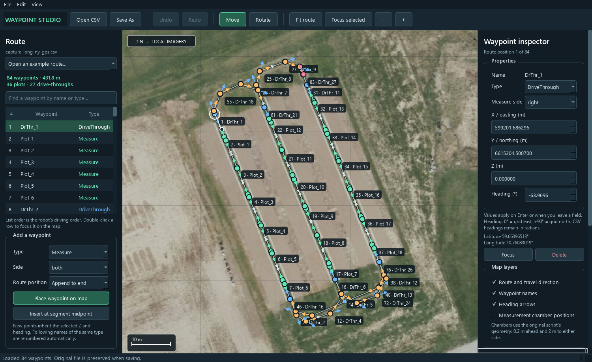
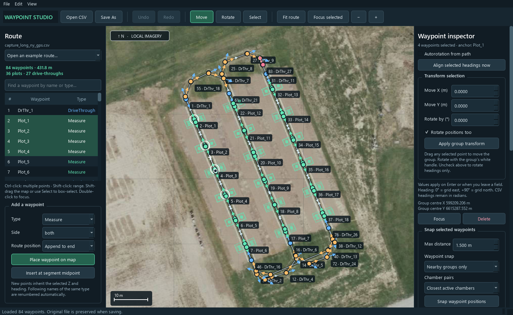

# Waypoint Studio

A native Python / Qt editor for robot waypoint routes, with offline satellite imagery.
The original experimental reviewer remains available in `analyze_coords.py`.





## Run

From this project directory in PowerShell:

```powershell
.\.venv\Scripts\Activate.ps1
python -m pip install -r requirements.txt
python waypoint_editor.py
```

You can also run it without activating the environment:

```powershell
.\.venv\Scripts\python.exe waypoint_editor.py
```

The editor opens `Waypoints/capture_long_ny_gps.csv` initially. Use **Open CSV** or
the example route dropdown to choose another file. Optional launch settings:

```powershell
python waypoint_editor.py Waypoints/Soil2Milk_hel.csv --crs EPSG:32632 --tiles static/Mapnik
```

## Review and edit

- **Navigate:** scroll to zoom around the cursor; drag empty map space or right-drag to pan.
  **Fit route** (`F`) shows the whole route. Double-click a route row to focus a waypoint.
- **Select:** click a waypoint on the map or a row in the route list. Ctrl-click toggles
  individual points; Shift-click selects a range in route order. Shift-drag empty map
  space to box-select, or use the **Select** tool and drag a box. Ctrl with box selection
  adds to the current selection. Ctrl+A while the map/list has focus selects the whole route.
  The list shows actual robot driving order. Search filters the list without changing the route
  or existing map selection.
- **Overlapping waypoints:** earlier route entries have larger circles and longer arrows,
  with later entries drawn on top at smaller sizes. Click an exposed ring or arrow to select
  its waypoint, or click its name tag. Ctrl-click rings, arrows or tags to select both points.
  Tags are spaced apart with leader lines linking them to their waypoints; in very crowded
  views, zoom in to reveal any tags that cannot fit on screen.
- **Move:** drag any selected waypoint with the **Move** tool to move the whole selection.
  A single waypoint also accepts X and Y in the inspector. With multiple points selected,
  **Transform selection** provides X/Y offsets and a rotation in degrees.
- **Rotate:** drag the white handle extending from the selected waypoint. With the
  **Rotate** tool, drag from a waypoint toward its desired heading. Multiple points rotate
  around their group centre; the white group handle controls this rotation. **Rotate positions
  too** rotates both positions and headings; unchecking it changes headings alone. For one
  waypoint, the inspector accepts an absolute heading in degrees. Zero is grid east; positive
  rotation is counterclockwise toward grid north. CSV headings remain in radians.
- **Autorotation:** checking **Autorotation from path** aligns the selected headings immediately
  and updates them during subsequent position/group edits. `DriveThrough` uses the incoming
  travel direction (previous → current); `Measure` and `TurningPoint` use the outgoing direction
  (current → next). `Stop` headings remain manual. The nearest distinct route neighbour is used
  when consecutive positions coincide. At an endpoint the other direction is used as fallback;
  a route with no usable segment keeps its heading. Selection alone does not edit the file.
  **Align selected headings now** applies the rule once to any selection, even when the checkbox
  is off. Unselected headings are preserved. Manual single-point rotation is disabled while
  autorotation is checked; group rotation can still rotate the positions and follow the new path.
- **Change properties:** choose type or measurement side, or edit coordinates/Z/heading.
  Numeric edits apply on Enter or when you leave the field. Types are `Measure`,
  `DriveThrough`, `TurningPoint`, and `Stop`.
- **Add:** choose type, side, and **Append to end**, **Insert before selected**, or
  **Insert after selected**. Click **Place waypoint on map**, then click its location.
  For insertion, you can instead use **Insert at segment midpoint**. A new waypoint
  inherits Z and heading from the selected waypoint; a midpoint uses the adjacent
  points’ average Z and circular mean heading. Set the desired properties in the inspector.
- **Delete:** use the inspector’s Delete button or press Delete while the map/list has focus.
  All selected waypoints are removed together and their affected naming families are renumbered.
- **Undo/redo:** `Ctrl+Z`, `Ctrl+Y`, or `Ctrl+Shift+Z`. A complete drag is one undo step.
  Every group transform, autorotation and snap is also one undo step. `Esc` cancels placement,
  box selection, or restores the whole selection before a drag.
- **Save:** **Save As** (`Ctrl+S`) exports a new CSV, initially suggesting `_edited.csv`.
  The app refuses to overwrite the CSV you originally opened. Existing export files
  use the normal Save As overwrite confirmation. Closing or opening another route
  prompts you to save unsaved changes.

Structural edits automatically adjust names of the affected types. For example,
inserting a Measure after `Plot_15` creates `Plot_16`, and subsequent plots become
`Plot_17`, `Plot_18`, etc. Drive-throughs and turning points have independent counters.
Existing prefix spelling (`DrThr_`, including alternative spellings in imported files)
and names before the insertion remain intact. Deletion closes the subsequent gap;
changing type updates both families. Loading, moving, rotating, or saving alone does
not renumber anything. Names after a structural edit become consecutive even if the
original route had gaps.

When several points are selected, insertion before/after uses the **anchor** named in the
inspector, which is the most recently active selected waypoint.

## Snapping

Select at least two waypoints and use **Snap selected waypoints** in the inspector.

- **Snap waypoint positions:** with **Nearby groups only**, selected points no farther apart
  than **Max distance** form groups and move to their group average X/Y. A chain of nearby points
  cannot collapse an entire row if its endpoints exceed that distance. **All selected to one average**
  brings the whole selection to one common position, regardless of distance. Each CSV row/name
  remains present, and Z is preserved. Autorotation is applied to the selection if enabled.
- **Snap chamber pairs:** selected measurement waypoints are paired by their nearest active
  chambers within **Max distance**. Choose closest chambers, left only, right only, or left-to-right
  pairing. Each robot participates in at most one pair per operation, so the result is exact rather
  than a compromise between conflicting chamber targets. For waypoints with **both** sides active,
  snapping averages the chamber-bar centres and orientations, then moves **and rotates** both
  robots so all four chambers coincide at two shared locations. The chamber spacing stays four
  metres. Same-side matches share a heading; left-to-right matches retain opposite headings.
  With a single active side, the chosen chambers meet at their original position midpoint and
  the waypoint headings are also aligned. Robot positions compensate for the physical chamber
  offsets, including the 0.2-metre forward offset. This is fully saved
  in the existing seven-column CSV, which derives chamber positions from robot X/Y and heading.
  Chamber snapping uses its fitted headings even when autorotation is enabled, to keep the alignment exact.
  A subsequent pose edit or path alignment can move those chambers again. Measurement chamber
  markers turn on automatically after snapping so the result is visible.

Snapping never merges or drops waypoints. Undo restores the complete operation.

## Coordinates and imagery

The supplied files match **WGS84 / UTM zone 32N (`EPSG:32632`)**. X/Y and Z remain in
the original coordinate system; the map display transforms them to Web Mercator.
The **Map setup** panel accepts another projected CRS in metres when needed. Changing
that setting changes how coordinates are interpreted, rather than rewriting the CSV.
Angles are interpreted relative to the coordinate system’s grid axes.

Local imagery is read directly from `static/Mapnik/{zoom}/{x}/{y}.jpg` (XYZ convention,
not TMS). PNG and JPEG tiles are also supported. Tiles are loaded only for the visible
map and cached; coarser images fill missing detailed tiles. No online map service or
browser is required. Areas outside the download show a dark background and a message.

Optional measurement chamber markers use the original geometry: 0.2 metres ahead
of the robot and 2 metres to each active side. **Measurement squares** draws real ground-sized
squares around those chambers, aligned with the field’s minimum-area bounding rectangle as
in the original reviewer. Automatic side length is the nearest distinct chamber distance;
coincident chambers are ignored for sizing. A lone chamber uses a 2-metre square. **Use a fixed
square size** selects a custom side length in metres. Squares are a display overlay and do not
change CSV data. Map names use non-overlapping clickable tags and leader lines.
Selected waypoints have white rings around their individual marker sizes.

## CSV format

No header, seven columns, in driving order:

```text
X,Y,Z,Angle,Type,MeasureSide,Name
599204.292028,6615298.6725,0.0,-1.16016834102,Measure,both,Plot_1
```

The first line above documents the columns; it is **not** written to exported files.
Measurement sides are `both`, `left`, `right`, or `none`. Unchanged numeric fields keep
their original textual precision. Blank lines in inputs are ignored. Invalid rows,
nonfinite numbers, and unsupported types/sides produce an error with the line number.
Exports use an atomic file replacement to avoid a truncated route if saving fails.

## Checks

```powershell
python -m unittest discover -s tests -v
```

These cover insertion/deletion/type naming, undo/redo and saved state, source protection,
CSV round trips through every supplied example, invalid input, projection round trips,
imagery coverage, and tile fallback. Headless Qt interaction checks also exercise dragging,
rotation, cancellation, zoom anchoring, inspector edits, map insertion/deletion, filtered
selection, and export with pending edits. Runtime dependencies for the original reviewer
are also kept in `requirements.txt`. Group selection and transforms, route-based headings,
square geometry, waypoint/chamber snapping, and saved chamber alignment have dedicated tests.
